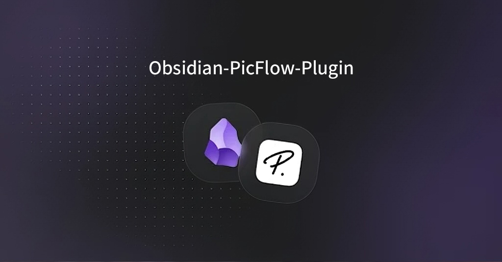

**PicFlow** is not about "Picture Flow" (image workflow), but rather a comprehensive end-to-end content production toolkit that addresses challenges throughout the writing and publishing process: **P**ublish (article publishing), **I**mage (image management), A**i** (AI-powered creation), **C**lip (web clipping), and more.

 

**PicFlow** 不是Picture Flow（图片流程），而是 文章发布（**P**ublish）、图片管理（**I**mage）、AI创作（A**i**）、剪藏（**C**lip）等在写作和发布过程中遇到问题的一整套全流程内容生产工具。

  <a href="https://nexus.nanbowan.top/en/picflow/docs/">English documents</a> 丨 <a href="https://nexus.nanbowan.top/zh/picflow/docs/">中文文档</a> 

## Product Vision (产品愿景)

### Value (j价值)

Solving the fragmentation pain points for Obsidian users in the content production pipeline:

 

解决 Obsidian 用户在内容生产链路中的割裂感：

*   **Difficult Collection**: Web clipping results in messy formatting, and images easily break (hotlink protection).
*   **Difficult Management**: Image hosting configuration is cumbersome, and switching between multiple environments is inconvenient.
*   **Difficult Creation**: Lacks convenient features for image generation and article polishing.
*   **Difficult Publishing**: Converting from Markdown to self-media platforms like WeChat Official Accounts and Zhihu requires repetitive formatting and manual image handling.

 

*   **采集难**：网页剪藏格式混乱，图片容易失效（防盗链）。
*   **管理难**：图床配置繁琐，多环境（公司/个人）切换不便。
*   **创作难**：缺乏便捷的图片生成、文章润色的功能。
*   **发布难**：从 Markdown 到公众号/知乎等自媒体平台需要反复排版和手动处理图片。

### Key（关键）

1.  **Closed-Loop Ecosystem**: Seamlessly connects the entire chain from "web clipping" to "article rewriting" to "image hosting storage" to "one-click publishing."
2.  **PicGo-Free**: No background process required; the plugin uploads directly via built-in SDK.

 

1.  **闭环生态**：从“网页剪藏”到“文章改写”到“图床存储”到“一键发布”，全链路打通。
2.  **去 PicGo 化**：无需后台进程，插件内置 SDK 直接上传。

### User Scenarios（场景）

To accommodate different user needs, the plugin supports the following combination scenarios:

 

为了覆盖不同用户的需求，插件支持以下组合场景：

1.  **Fetch Only**:
    *   Scenario: You come across a great article and simply want to save it to your local Obsidian vault without AI rewriting or publishing.
    *   Workflow: Enter URL -> Parse -> Save Markdown (with original image links or transfer to S3).
2.  **Rewrite Only**:
    *   Scenario: You've written a note and want to use AI to polish it or generate a summary and supporting images.
    *   Workflow: Select text -> AI Polish -> Replace/Append -> Insert at specified location.
3.  **Publish Only**:
    *   Scenario: You have existing local notes that you want to publish to self-media platforms like WeChat Official Accounts or Zhihu with one click.
    *   Workflow: Open note -> Click Publish -> Select Platform -> Success.
4.  **Full Process**:
    *   Scenario: Content curation + automated operations.
    *   Workflow: Enter URL -> Parse -> AI Rewrite -> Auto Publish.

 

1.  **仅剪藏 (Fetch Only)**:
    *   场景：看到一篇好文章，只想保存到本地 Obsidian，不需要 AI 改写也不发布。
    *   流程：输入 URL -> 解析 -> 保存 Markdown (含原图链接或转存 S3)。
2.  **仅改写 (Rewrite Only)**:
    *   场景：自己写了一段笔记，想用 AI 润色或生成摘要、配图。
    *   流程：选中复本 -> AI 润色 -> 替换/追加 -> 插入指定位置。
3.  **仅发布 (Publish Only)**:
    *   场景：本地已有的笔记，想一键发布到公众号/知乎等自媒体平台。
    *   流程：打开笔记 -> 点击发布 -> 选择平台 -> 成功。
4.  **全流程 (Full Process)**:
    *   场景：搬运 + 自动化运营。
    *   流程：输入 URL -> 解析 -> AI 改写 -> 自动发布。

## Feature Overview（功能介绍）

### One-Click Publishing Support Platforms（一发发布支持平台）

| Publishing Platform | Status | Documentation |
| :------------------ | :----- | :------------ |
| **WeChat Official Accounts (WeChat MP)** | ✅ Supported | |
| **Bilibili (Columns)** | ✅ Supported | |
| **Weibo Headlines** | ✅ Supported | |
| **Zhihu** | ✅ Supported | |
| **Juejin** | ✅ Supported | |
| **CSDN** | ✅ Supported | |
| **WordPress**       | ✅ Supported | |
| **Webhook**              | ✅ Supported | |
| **MCP**              | ✅ Supported | |
| **Xiaohongshu** | 📅 In Progress | |
| **Jianshu** | 📅 In Progress | |
| **Toutiao** | 📅 In Progress | |
| **Baijiahao** | 📅 In Progress | |
| **Dayu** | 📅 In Progress | |
| **Sohu** | 📅 In Progress | |
| **Yidian** | 💡 Planned | |
| **X (Twitter)** | 💡 Planned | |
| **Yuque** | 💡 Planned | |
| **Notion** | 💡 Planned | |
| **Douban** | 💡 Planned | |
| **Everyone is a Product Manager** | 💡 Planned | |

 

| 发布平台                  | 状态     | 文档  |
| :-------------------- | :----- | :--- |
| **微信公众号 (WeChat MP)** | ✅ 已支持。 |     |
| **Bilibili (专栏)**     | ✅ 已支持  |     |
| **微博头条 (Weibo)**      | ✅ 已支持  |     |
| **知乎 (Zhihu)**        | ✅ 已支持  |     |
| **掘金 (Juejin)**       | ✅ 已支持  |     |
| **CSDN**              | ✅ 已支持  |     |
| **WordPress**       | ✅ 已支持  |     |
| **Webhook**              | ✅ 已支持  |     |
| **MCP**              | ✅ 已支持  |     |
| **小红书 (Xiaohongshu)** | 📅进行中  |     |
| **简书 (Jianshu)**      | 📅进行中  |     |
| **今日头条 (Toutiao)**    | 📅进行中  |     |
| **百家号 (Baijiahao)**   | 📅进行中  |     |
| **大鱼号 (Dayu)**        | 📅进行中  |     |
| **搜狐号 (Sohu)**        | 📅进行中  |     |
| **一点号 (Yidian)**      | 💡规划中  |     |
| **X (Twitter)**       | 💡规划中  |     |
| **语雀 (Yuque)**        | 💡规划中  |     |
| **Notion**            | 💡规划中  |     |
| **豆瓣 (Douban)**       | 💡规划中  |     |
| **人人都是产品经理**          | 💡规划中  |     |

### Theme CSS Rules（主题 CSS 规则）

Please use the following standard selectors to control the styling of different elements. The plugin will automatically wrap content with the `.picflow-container` class.

 

请使用以下标准选择器来控制不同元素的样式。插件会自动为内容包裹 `.picflow-container` 类。

| Element | Selector Example | Example |
| :------ | :--------------- | :-------- |
| **Container** | `.picflow-container` | `font-family`, `font-size: 16px`, `line-height: 1.6`, `text-align: justify`, `color: #333` |
| **H1** | `.picflow-container h1` | `font-size: 24px`, `font-weight: bold`, `border-bottom: 2px solid #07c160`, `margin: 20px 0` |
| **H2** | `.picflow-container h2` | `font-size: 20px`, `border-left: 5px solid #07c160`, `padding-left: 10px`, `background: #f6f6f6` |
| **H3** | `.picflow-container h3` | `font-size: 18px`, `font-weight: bold`, `color: #555` |
| **Paragraph** | `.picflow-container p` | `margin-bottom: 15px`, `letter-spacing: 0.5px` (improves reading experience) |
| **Lists** | `.picflow-container ul`, `ol` | `padding-left: 20px`, `margin-bottom: 15px` |
| **List Item** | `.picflow-container li` | `margin-bottom: 5px` |
| **Blockquote** | `.picflow-container blockquote` | `border-left: 4px solid #ddd`, `background: #f9f9f9`, `padding: 10px 15px`, `color: #666` |
| **Code Block** | `.picflow-container pre` | `background: #282c34`, `color: #abb2bf`, `padding: 15px`, `border-radius: 5px`, `overflow-x: auto` |
| **Inline Code** | `.picflow-container code` | `background: #fff5f5`, `color: #ff502c`, `padding: 2px 5px`, `border-radius: 3px` |
| **Link** | `.picflow-container a` | `color: #576b95`, `text-decoration: none`, `border-bottom: 1px dashed #576b95` |
| **Image** | `.picflow-container img` | `display: block`, `margin: 20px auto`, `max-width: 100%`, `border-radius: 6px`, `box-shadow: 0 2px 10px rgba(0,0,0,0.1)` |
| **Bold** | `.picflow-container strong` | `color: #000`, `font-weight: bold` |
| **Table** | `.picflow-container table` | `width: 100%`, `border-collapse: collapse`, `font-size: 14px` |
| **Table Header** | `.picflow-container th` | `background: #f0f0f0`, `padding: 8px`, `border: 1px solid #ddd` |
| **Table Cell** | `.picflow-container td` | `padding: 8px`, `border: 1px solid #ddd` |

 

| 元素 | 选择器示例 | 示例 |
| :--- | :--- | :--- |
| **容器** | `.picflow-container` | `font-family`, `font-size: 16px`, `line-height: 1.6`, `text-align: justify` (两端对齐), `color: #333` |
| **一级标题** | `.picflow-container h1` | `font-size: 24px`, `font-weight: bold`, `border-bottom: 2px solid #07c160`, `margin: 20px 0` |
| **二级标题** | `.picflow-container h2` | `font-size: 20px`, `border-left: 5px solid #07c160`, `padding-left: 10px`, `background: #f6f6f6` |
| **三级标题** | `.picflow-container h3` | `font-size: 18px`, `font-weight: bold`, `color: #555` |
| **段落** | `.picflow-container p` | `margin-bottom: 15px`, `letter-spacing: 0.5px` (字间距提升阅读体验) |
| **列表** | `.picflow-container ul`, `ol` | `padding-left: 20px`, `margin-bottom: 15px` |
| **列表项** | `.picflow-container li` | `margin-bottom: 5px` |
| **引用块** | `.picflow-container blockquote` | `border-left: 4px solid #ddd`, `background: #f9f9f9`, `padding: 10px 15px`, `color: #666` |
| **代码块** | `.picflow-container pre` | `background: #282c34`, `color: #abb2bf`, `padding: 15px`, `border-radius: 5px`, `overflow-x: auto` |
| **行内代码** | `.picflow-container code` | `background: #fff5f5`, `color: #ff502c`, `padding: 2px 5px`, `border-radius: 3px` |
| **链接** | `.picflow-container a` | `color: #576b95`, `text-decoration: none`, `border-bottom: 1px dashed #576b95` |
| **图片** | `.picflow-container img` | `display: block`, `margin: 20px auto`, `max-width: 100%`, `border-radius: 6px`, `box-shadow: 0 2px 10px rgba(0,0,0,0.1)` |
| **加粗** | `.picflow-container strong` | `color: #000`, `font-weight: bold` |
| **表格** | `.picflow-container table` | `width: 100%`, `border-collapse: collapse`, `font-size: 14px` |
| **表头** | `.picflow-container th` | `background: #f0f0f0`, `padding: 8px`, `border: 1px solid #ddd` |
| **单元格** | `.picflow-container td` | `padding: 8px`, `border: 1px solid #ddd` |

---

The document is being updated...